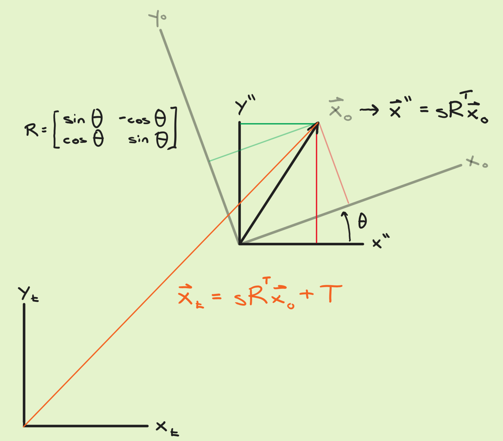

# 3d-conformal-testing
A series of functions purpose built for testing and comparing various methods of performing the 3D conformal coordinate transformation (i.e. absolute orientation).

## Overview
The 3D conformal coordinate transformation has applications in photogrammetry, lidar, robotics, and geodesy. In these applications, one must express the coordinates of a set of 3D points known in one coordinate system relative to another coordiante system. For example, data collected by a lidar scanner are initially expressed in a coordinate system which is relative to the scanner, but the desired result is to express these data in terms of a world coordinate system. One means of finding the relationship between two coordinate systems is to measure the coordinates of a set of points common to both the coordinate systems. Once the relationship between the two coordinate systems—the transformation—is solved, the whole of the point data in one system can be transformed to the other.

The 3D conformal coordinate transformation is commonly expressed as seven parameters: A uniform scale factor, three sequential rotation angles (one about each of the three axes of the target coordinate system), and three translations (one along each of the three axes of the target coordinate system). This transformation preserves the shape of the data being transformed, i.e., no skew, non-uniform scaling, perspective warp, etc. is introduced.

There are a number of means of solving for the transformation, each with their advantages and shortcomings. The purpose of this experiment is to explore these pros and cons among a number of solution methods for the purpose of providing guidance to researchers and practitioners who wish to examine the efficacy of any software packages which perform a 3D conformal transformation, or to develop their own implementations of the transformation.

## Example usage
After a dataset is generated, the transformation can be solved using the available methods:
```
% Generate the dataset
[arb, con, hgt, noise] = generate3DPoints(5, 0.1);

% Solve for transformation using Horn closed-form method
hgt_horn = hornConf3D(arb + noise, con);

% Solve via Lassiter method (direct linear estimation of rotation only)
[hgt_las, jac_las, K_las] = lasConf3D(arb + noise, con);

% Solve via direct linear estimation of all parameters
[hgt_las2, jac_las2, K_las2] = lasConf3D_2(arb + noise, con);
```
This basic workflow can be nested inside a `for` loop, and outputs stored approriately, for the purposes of Monte Carlo simulations or other tests.

## The 3D conformal coordinate transformation
For a set of $n$ points $\mathbf{x}_i = \langle x_i,y_i,z_i \rangle \ \forall i \in (1,...,n)$ whose coordinates are known in both an original and a target coordinate system, the 3D conformal coordinate transformaion is

```math
\mathbf{x}_t = sR^T\mathbf{x}_o + \mathbf{T}
```

where $s$ is the scale factor, $R^T$ is the rotation, and $\mathbf{T}$ is the translation. Subscipts $_o$ and $_t$ denote the original and target coordinate systems.

The 3D conformal coordinate transformation as presented here is an inverse problem, where the parameters of the transformation must be solved using observations made on a set of points common to the two corodinate systems.

I should explain my choice here to denote the rotation as $R^T$. Commonly in photogrammetry and lidar, a rotation matrix describes the pose of a coordinate system with respect to another coordinate system. Thus, if a rotation matrix $R$ describes the pose of the original coordinate system with respect to the target coordinate system, then the inverse of that rotation would need to be applied to the original coordinate system to bring it parallel to the target coordinate system. For an orthonormal matrix, its inverse equals its transpose, thus the use of $R^T$.

It is also the convention in photogrammetry and lidar to express rotations as rotations of space, and not rotations of vectors. This is often called a passive rotation.

In the figure below, the pose of the original coordinate system with respect to the target coordinate system is described as a passive Givens rotation matrix. A vector expressed in terms of the original system has coordinates $\mathbf{x}_o = \langle x_o, y_o \rangle$. This vector cannot be related to the target coordinate system unless its frame is parallel and equal in scale to the target coordinate system. It is the work of the 3D conformal coordinate transformation to do this.


*Figure: A diagram illustrating a 2D conformal coordinate transformation. The rotation matrix is a passive Givens rotation matrix, which is to say, the inverse of a Givens rotation matrix. The original coordinate system is one half the scale of the target coordinate system. While the figure implies that the translation* $\mathbf{T}$ *is the difference between the two coordinate systems' origins, note that this is an inverse problem, and the location of the origin of the original coordinate system with respect to the target coordinate system is unknown.*

## Direct linear estimation of initial approximations

A common method for solving for the transformation parameters is a nonlinear least squares adjustment. The transformation is expressed as a set of three observation questions per point:

```math
\mathbf{x}_t = sR^T\mathbf{x}_o + \mathbf{T} \implies \\
```

```math
\begin{bmatrix}
x_t \\ y_t \\ z_t
\end{bmatrix} = 

s\begin{bmatrix}
r_{11} & r_{21} & r_{31} \\
r_{12} & r_{22} & r_{32} \\
r_{13} & r_{23} & r_{33}
\end{bmatrix}

\begin{bmatrix}
x_o \\ y_o \\ z_o
\end{bmatrix}

+

\begin{bmatrix}
T_x \\ T_y \\ T_z
\end{bmatrix} \implies \\
```
```math
\begin{aligned}
x_t = sr_{11}x_o + sr_{21}y + sr_{31} + T_x \\
y_t = sr_{12}x_o + sr_{22}y + sr_{32} + T_y \\
z_t = sr_{13}x_o + sr_{23}y + sr_{33} + T_z
\end{aligned}
```

If the elements of matrix $R$ are treated as coefficients, then this is a linear problem. However, these elements of $R$ are commonly expressed in terms of trigonometric functions of Euler angles—omega $\omega$, phi $\phi$, and kappa $\kappa$—which describe three sequential rotations about the $x$-, $y$-, and $z$-axes, respectively. In other words, the above observation equations are nonlinear, and thus a nonlinear least squares solution requires initial approximations.

Obtaining the initial approximations using only the coordinate correspondences in the initial and targets coordinate systems is an open problem. The method proposed by Dewitt (1996)[^1] is taught in a popular textbook on photogrammetry (Wolf et al. 2014)[^2], but this five-step method requires decisions on which of the common points to use, and only three common points can be used. Ruffhead (2021)[^3] offers a novel approach to the problem, but the method presented relies upon the use of small angle approximations, which is applicable to the Bursa-Wolf transformation in geodesy, but is not generally applicable to photogrammetry or lidar. A direct linear method is presented by Awange and Grafarend (2003)[^4] using a technique called the Grobner basis, and while the solution is linear, its implementation is by no means simpler, nor was it demonstrated by the authors to be advantageous in terms of accuracy/fit.

The method I propose for obtaining the initial approximations for a nonlinear least squares solution to the 3D conformal coordinate transformation is straightforward to implement via linear least squares, and with only three steps. And while my method requires a minimum of four point common to each coordinate system, it has the advantage of allowing all of the common points to be used in the obtaining of the initial approximations. The linear least squares method also allows for data snooping (i.e. the identification and removal of outliers). 

### Direct linear estimation of all parameters 
Coming soon.

### Direct linear estimation of rotation matrix elements
Coming soon.

## Horn closed-form unit quaternion method
`hornConf3d()` performs BKP Horn's algorithm for a closed-form solution to the absolute orientation problem (i.e., a 3D conformal transformation)[^5]. 

The algorithm first solves for the best rotation between the systems before solving for scale and translation. The algorithm, as well as some notes about its implementation in MATLAB, are summerized below. (I defer to Horn's manuscript for derivation and detailed explanation.)

### 1. Translate to origin
Find the centroids of the set of points in each coordinate system $\bar{\mathbf{x}_l}$ and $\bar{\mathbf{x}_r}$. Subtract each from its respective set. This yields two sets of translated point sets, denoted by a prime: $\mathbf{x}'_{l,i}$ and $\mathbf{x}'_{r,i}$.

### 2. Matrix of sums of products
There is a $3 \times 3$ matrix whose elements are the sums of products of coordinates in the left system multiplied by coordinates in the right system. As notated by Horn, this matrix is
```math
M=\begin{bmatrix}
S_{xx} & S_{xy} & S_{xz} \\
S_{yx} & S_{yy} & S_{yz} \\
S_{zx} & S_{zy} & S_{zz}
\end{bmatrix}
```
where
```math
S_{xx}= \sum_ {i=1} ^{n} = x' _{l,i} x'_ {r,i}
```
```math
S_{xy}= \sum_ {i=1} ^{n} = x' _{l,i} y'_ {r,i}
```
etc.

If the points as column vectors are adjoined as $3 \times n$ matrices $M_l$ and $M_r$ then

```math
M=M_l M_r^T
```

### 3. Real symmetric matrix $N$
There is a $4 \times 4$ real symmetric matrix $N$ which can be found using the elements of matrix $M$:

```math
N=\begin{bmatrix}
S_{xx} + S_{yy} + S_{zz} & S_{yz} - S_{zy} & S_{zx} - S_{xz} & S_{xy} - S_{yx} \\
S_{yz} - S_{zy} & S_{xx} - S_{yy} - S_{zz} & S_{xy} + S_{yx} & S_{zx} + S_{xz} \\
S_{zx} - S_{xz} & S_{xy} + S_{yx} & -S_{xx} + S_{yy} - S_{zz} & S_{yz} + S_{zy} \\
S_{xy} - S_{yx} & S_{zx} + S_{xz} & S_{yz} + S_{zy} & -S_{xx} - S_{yy} + S_{zz}
\end{bmatrix}
```

### 4. Finding the rotation as a unit quaternion
In the manuscript it is shown that there is a unit quaternion $\dot{q}$ which describes the rotation from the left  to the right coordinate system. It is also shown that this unit quaternion $\dot{q}$, which maximizes the product $\dot{q}^TN\dot{q}$, is that eigenvector which corresponds to the most positive eigenvalue of matrix $N$. This eigenvector is found in the code using `[V, D] = eig(N)` and converted to a rotation matrix using `quat2rotm()`.

### 5. Finding scale
Horn presents three formulas for finding the scale of the transformation. In this code I implement the symmetric scale formula:

```math
s=\sum_{i=1}^{n} ||\mathbf{x}'_{r,i}|| \ \ / \ \sum_{i=1}^{n} ||\mathbf{x}'_{l,i}||
```

Using the methods shown by Horn (and others), scale can be determined without knowing the rotation, and the solution for rotation is not affected by the scale. 

### 6. Finding the translation
The translation is the difference between the centroid of the right coordinate system and the scaled and rotated centroid of the left coordinate system.

### Discussion of the Horn method
There is a clear advtantage in this method in how simple it is to implement in code, its speed when compared to iterative methods, and the stability of being a closed-form solution. To add, though not mentioned in the summary above, a stochastic model can be added to the algorithm by using weighted means to find the centroids, weighting the norms when finding scale, and weighting the sums of products in matrix $M$. These weights can be calculated using *a priori* estimates of uncertainty from the measurements in both coordinate systems, which is an advantage over the stochastic model implemented in a typical least squares adjustment.

In my view, this solution has two disadvantages. First, there is no method to detect outliers in the data sets; at no point in the closed-form solution is there an indication that potential outlier point(s) have been included in the solution. Second, evaluating the quality of the solution for rotation after completion is difficult. While residuals can be found from the differences between the measured points in one or both of the coordiante systems versus the transformed points, conventional error propagation cannot be performed on the rotation. While the residuals can provide an estimate of the uncertainties of the observations, there is, to my knowledge, no means of analytical error propagation which would provide estimates of the uncertianties of the transformation parameters.

[^1]: Dewitt BA. Initial approximations for the three-dimensional conformal coordinate transformation. Photogrammetric engineering and remote sensing. 1996 Jan 1;62(1):79-84. https://www.asprs.org/wp-content/uploads/pers/1996journal/jan/1996_jan_79-83.pdf
[^2]: Wolf PR, Dewitt BA, Wilkinson BE. Elements of Photogrammetry with Applications in GIS. 4th edition. New York: McGraw-Hill Education. 2014. https://www.accessengineeringlibrary.com/content/book/9780071761123
[^3]: Ruffhead AC. Derivation of rigorously-conformal 7-parameter 3D geodetic datum transformations. Survey Review. 2021 Jan 2;53(376):8-15. https://doi.org/10.1080/00396265.2019.1665614
[^4]: Awange JL, Grafarend EW. Groebner-basis solution of the three-dimensional resection problem (P4P). Journal of Geodesy. 2003 Aug;77:327-37. https://doi.org/10.1007/s00190-003-0328-3
[^5]: Horn BK. Closed-form solution of absolute orientation using unit quaternions. Josa a. 1987 Apr 1;4(4):629-42. https://doi.org/10.1364/JOSAA.4.000629